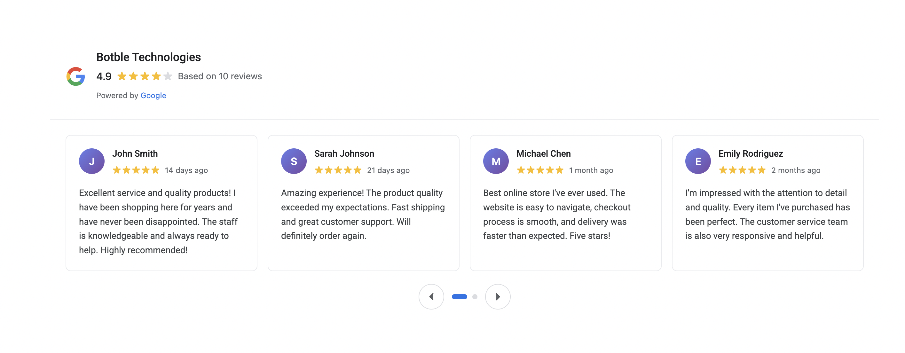
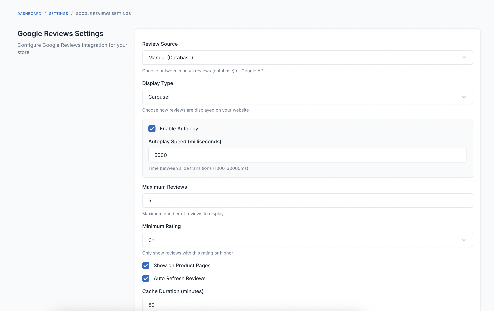

# FOB Google Reviews

A professional Google Reviews widget for Botble CMS that displays Google Business reviews with a beautiful carousel interface. Designed to match modern review widget designs with responsive layouts and extensive customization options.

## Requirements

- Botble core 7.5.0 or higher.
- PHP 8.2 or higher.

## Installation

### Install via Admin Panel

Go to the **Admin Panel** and click on the **Plugins** tab. Click on the "Add new" button, find the **FOB Google Reviews** plugin and click on the "Install" button.

### Install manually

1. Download the plugin from the [Botble Marketplace](https://marketplace.botble.com/products/friendsofbotble/fob-google-reviews).
2. Extract the downloaded file and upload the extracted folder to the `platform/plugins` directory.
3. Go to **Admin** > **Plugins** and click on the **Activate** button.

## Features

- **Beautiful Design**: Professional widget matching modern Google Reviews design
- **Responsive Carousel**: Auto-playing carousel with touch/swipe support
- **Mobile Responsive**: Adapts from 1 to 4 columns based on screen size
- **Highly Configurable**: Extensive settings for customization
- **Smart Caching**: Reduces API calls with configurable cache duration
- **Per-Product Settings**: Override place ID per product
- **Multi-language**: Supports 42 languages
- **Accessible**: ARIA labels and keyboard navigation support
- **Theme Independent**: Works with all Botble themes
- **Multiple Display Types**: Choose between Carousel, Grid, or List layouts
- **Dual Source Mode**: Use Google API or manual database reviews

## Usage

### Review Source Modes

The plugin supports two modes for displaying reviews:

#### 1. Manual Mode (Default)

- Reviews stored in database
- Full control over review content
- No API costs
- No external dependencies
- Easy to manage via admin panel or seeder

**Use Case**: When you want complete control over reviews, don't have Google API access, or want to curate specific reviews.

**Setup**:
1. Go to **Settings** > **Google Reviews**
2. Select "Manual (Database)" as Review Source
3. Add reviews manually or run seeder

#### 2. Google API Mode

- Fetches real reviews from Google My Business
- Automatic updates
- Shows authentic customer reviews
- Requires Google Places API key

**Use Case**: When you want to display real Google reviews automatically.

**Setup**:
1. Get Google API Key (see below)
2. Go to **Settings** > **Google Reviews**
3. Select "Google API" as Review Source
4. Enter API Key and Place ID

### Getting Started with Google API

#### 1. Get Google API Key

1. Go to [Google Cloud Console](https://console.cloud.google.com/)
2. Create a new project or select existing one
3. Enable **Google Places API**
4. Create an API key from **Credentials** section
5. (Optional) Restrict the API key to Places API only

#### 2. Get Place ID

**Method 1: Using Place ID Finder**
1. Visit [Google Place ID Finder](https://developers.google.com/maps/documentation/places/web-service/place-id)
2. Search for your business
3. Copy the Place ID

**Method 2: Using Google Maps**
1. Open Google Maps
2. Search for your business
3. The Place ID is in the URL after `!1s` or use the Share button

### Configuration

#### Configure Global Settings

Navigate to **Settings** > **Google Reviews** to configure:

**Review Source**
- Choose between Manual (Database) or Google API mode

**API Settings** (API Mode only)
- **Google API Key**: Your Google Places API key
- **Default Place ID**: Your Google Business place ID
- **Business Name**: Override business name (optional)

**Display Settings**
- **Display Type**: Choose Carousel, Grid, or List
- **Maximum Reviews**: How many reviews to show (1-20)
- **Minimum Rating**: Filter reviews by minimum stars (0-5)

**Carousel Settings** (Carousel Mode only)
- **Enable Autoplay**: Auto-advance carousel
- **Autoplay Speed**: Time between slides (1000-30000ms)

**Grid Settings** (Grid Mode only)
- **Reviews Per Row**: Number of reviews per row (1-4)

**Visibility**
- **Show on Product Pages**: Display on product detail pages
- **Show "View All Reviews" Button**: Link to Google reviews page

**Performance**
- **Auto Refresh Reviews**: Automatically refresh cached data
- **Cache Duration**: How long to cache reviews (5-1440 minutes)

**Appearance**
- **Widget Title**: Custom title for the widget
- **Show Ratings Summary**: Display overall rating and count
- **Show Author Avatar**: Display reviewer's profile picture
- **Show Author Name**: Display reviewer's name
- **Show Review Date**: Display when review was posted
- **Show Star Ratings**: Display star ratings
- **Review Text Length**: Maximum characters to display
- **Show "Read More" Link**: Display link for truncated reviews

#### Per-Product Configuration

1. Edit any product
2. Scroll to **Google Reviews** metabox
3. Enable Google Reviews for this product
4. (Optional) Add custom Place ID to show different location reviews

### Using Shortcodes

You can place the Google Reviews widget anywhere on your site using the shortcode.

**In Page Content (Visual Editor):**
1. Edit any page
2. Click the **Shortcode** button in the editor
3. Select **Google Reviews** from the list
4. (Optional) Add custom title
5. Insert the shortcode

**Manual Shortcode:**
```
[google-reviews][/google-reviews]
```

**In Blade Templates:**
```php
{!! Shortcode::compile('[google-reviews][/google-reviews]') !!}
```

**In PHP Code:**
```php
echo do_shortcode('[google-reviews][/google-reviews]');
```

### Managing Manual Reviews

When using Manual mode, reviews are stored in the `google_reviews_data` table.

#### Via Admin Panel

1. Go to **Google Reviews** > **Reviews** in the admin menu
2. Click "Create Review" to add new reviews
3. Fill in review details (author name, rating, text, etc.)
4. Set display order (lower numbers appear first)
5. Save the review

#### Via Seeder

Run the seeder to create sample reviews:

```bash
php artisan db:seed --class="FriendsOfBotble\\GoogleReviews\\Database\\Seeders\\GoogleReviewsSeeder"
```

#### Via Laravel Tinker

```bash
php artisan tinker
```

```php
FriendsOfBotble\GoogleReviews\Models\GoogleReviewData::create([
    'author_name' => 'Jane Smith',
    'rating' => 5,
    'text' => 'Excellent service and quality!',
    'review_date' => now()->subWeeks(2),
    'is_active' => true,
    'order' => 1
]);
```

## Widget Features

### Header Section
- Google logo
- Business name
- Overall rating with stars
- Total review count
- "Powered by Google" attribution

### Review Cards
- Reviewer avatar (or initial bubble if no photo)
- Reviewer name
- Star rating
- Relative time ("2 weeks ago")
- Review text with "Read more" for long reviews

### Carousel Navigation
- Previous/Next buttons
- Dot indicators
- Touch/swipe support on mobile
- Keyboard navigation
- Auto-play with pause on hover

### Responsive Layout
- **Mobile (< 768px)**: 1 card
- **Tablet (768px - 1023px)**: 2 cards
- **Desktop (1024px - 1279px)**: 3 cards
- **Large Desktop (≥ 1280px)**: 4 cards

## Screenshots

### Google Reviews Widget

*Professional Google Reviews carousel widget displaying customer reviews with ratings, avatars, and responsive design*

### Plugin Settings Page

*Comprehensive settings page with collapsible sections for Review Source, Display Type, and extensive customization options*

## Development

### Building Assets

The plugin uses webpack to compile SCSS and JavaScript files.

```bash
# Development build
npm run dev

# Production build
npm run prod

# Watch for changes
npm run watch

# Build specific plugin
npm run dev -- --mix-config=platform/plugins/fob-google-reviews/webpack.mix.js
```

### Asset Structure

```
platform/plugins/fob-google-reviews/
├── webpack.mix.js           # Webpack configuration
├── resources/
│   ├── sass/
│   │   └── google-reviews.scss   # Source SCSS file
│   └── js/
│       └── google-reviews.js     # Source JavaScript file
└── public/                  # Compiled assets (production)
    ├── css/
    │   └── google-reviews.css
    └── js/
        └── google-reviews.js
```

## API Limits

Google Places API has usage limits:

- **Free Tier**:
  - $200 monthly credit (~40,000 requests)
  - Basic Data: $17 per 1,000 requests
  - Contact Data: $3 per 1,000 requests

**Optimization Tips:**
- Increase cache duration (default: 60 minutes)
- Set appropriate max reviews limit
- Use per-product place IDs only when needed

## Troubleshooting

### No Reviews Showing

**Check:**
1. API key is valid and Places API is enabled
2. Place ID is correct
3. Cache duration - try clearing cache
4. Browser console for errors

**Clear Cache:**
```bash
php artisan cache:clear
```

### Styling Issues

**Check:**
1. Assets are published: `php artisan vendor:publish --tag=cms-public --force`
2. CSS file exists at: `public/vendor/core/plugins/fob-google-reviews/css/google-reviews.css`
3. No theme CSS conflicts

### Carousel Not Working

**Check:**
1. JavaScript file loaded correctly
2. Browser console for errors
3. Clear browser cache

## Security

- API keys stored securely in database
- XSS protection on review text
- CSRF protection on all forms
- Sanitized user inputs

## Browser Support

- Chrome/Edge (latest)
- Firefox (latest)
- Safari (latest)
- Mobile browsers (iOS Safari, Chrome)

## Contributing

Please see [CONTRIBUTING](CONTRIBUTING.md) for details.

## Bug Reports

If you discover a bug in this plugin, please [create an issue](https://github.com/FriendsOfBotble/fob-google-reviews/issues).

## Security

If you discover any security related issues, please email friendsofbotble@gmail.com instead of using the issue tracker.

## Credits

- [Friends Of Botble](https://github.com/FriendsOfBotble)
- [All Contributors](../../contributors)

## License

The MIT License (MIT). Please see [License File](LICENSE) for more information.
